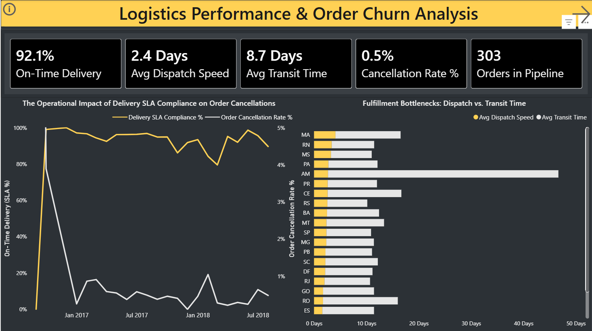
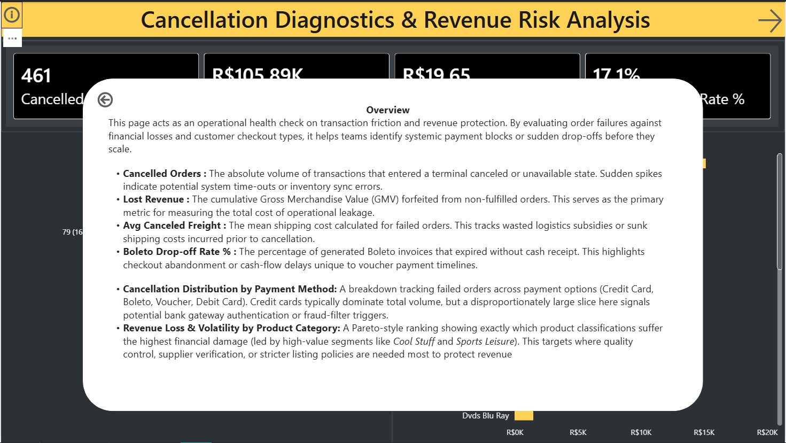

# Olist Logistics Analytics Engine (dbt Cloud & Databricks)

## 📌 Project Overview
This project builds a robust, enterprise-grade Analytics Engineering pipeline transforming raw e-commerce data into a high-performance star schema layout. The primary business objective of this pipeline is to diagnose multi-point operational friction across the supply chain, identify geographic freight bottlenecks, and isolate the upstream drivers of customer order cancellations. By transforming raw source tables into a refined star schema, this engine empowers operational stakeholders to pivot from passive historical reporting to proactive revenue protection and logistics optimization.

### Modern Data Stack:
* **Data Lakehouse:** Databricks (Compute, Storage, & Delta Catalog)
* **Transformation Layer:** dbt Cloud (Staging, Intermediate, and Marts layers)
* **Version Control:** GitHub
* **BI & Analytics:** Power BI (Star-schema dimensional reporting)

**Dataset:** [Olist E-Commerce Public Dataset](https://www.kaggle.com/datasets/olistbr/brazilian-ecommerce)

---

## 🏗️ Analytics Architecture & Data Lineage
The repository enforces a strict multi-layer dbt architecture to isolate raw data cleanup from complex multi-row window calculations and final presentation facts:

```text
📂 models/
├── 📂 staging/
│   ├── sources.yml
│   ├── stg_customers.sql          # Standardizes geographic entities and unique customer hashes
│   ├── stg_order_items.sql        # Casts numeric values and exposes item-level grains
│   └── stg_orders.sql             # Standardizes timestamps and injects active binary status flags
│
├── 📂 intermediate/
│   ├── int_orders_operational_metrics.sql # Calculates multi-point time deltas (hours/days)
│   └── int_customer_order_history.sql    # Employs window functions to calculate prior lifetime behaviors
│
└── 📂 marts/                           
    ├── 📂 core/
    │   └── dim_customers.sql      # Shared Dimension: Deduplicated customer attributes & lifetime metrics
    └── 📂 logistics/
        ├── fct_order_items.sql    # Central Fact Table: Granular item-level logistics performance grain
        └── schema.yml             # Automated data quality schema definitions and referential integrity tests
```
---
## ## 📊 Business Intelligence & UI/UX Architecture

The downstream Power BI reporting tier delivers a highly polished, interactive corporate performance suite. The dashboard relies on a clean, dark-themed presentation layer sitting on top of a strictly modeled, high-performance dimensional star schema.

### 🗄️ Dimensional Data Modeling & DAX Architecture
The semantic layer is engineered with clean separation of concerns, enforcing unidirectional 1-to-Many ($1 \rightarrow *$) relationship rails extending from decoupled master data dimensions into a central, low-grain transactional fact table:
* **Central Fact Table:** `fct_orders_items` (captures granular item-level fulfillment, revenue, and logistics data).
* **Dimension Tables:** Explicitly structured filtering contexts for comprehensive business analysis:
  * `dim_customers` – Encapsulates customer hashes, geographical entities, and lifetime behavior tracking.
  * `dim_payments` – Maps transactional payment preferences and gateway types.
  * `dim_products` – Segments the vast e-commerce SKU library into localized product categories.
  * `dim_sellers` – Isolates vendor performance and geographic distribution networks.
* **DAX Governance:** All explicit calculation logic—including time-to-delivery deltas, SLA percentages, and financial risk values—is consolidated inside a dedicated, isolated folder (`_measures`) to maintain enterprise-grade file cleanliness and discoverability.

### 💡 Advanced Portfolio UI/UX Implementations
* **Dynamic Navigation Mechanics:** Features a native, low-friction **Page Navigation** header framework (e.g., the custom `CD&RRA` navigation index) that provides seamless, app-like page traversal for business users.
* **State-Protected Glossary Pop-Up Overlays:** Formatted custom information modals using a combination of the **Selection Pane** and **Action-driven Bookmarks**. Crucially, the underlying bookmarks are configured to explicitly ignore the *Data State*—ensuring that stakeholders can pop open structural terminology panels without clearing out active slicers, time parameters, or regional filters.

---

## 🖼️ Dashboard Interface Showcase
*Click the headers below to expand and view the high-resolution operational dashboards.*

<details>
<summary><b>🚚 Page 1: Fulfillment & Logistics Performance</b></summary>
<br> 

</details>

<details>
<summary><b>📐 Page 2: Cancellation Diagnostics (Standard View)</b></summary>
<br>

</details>

<details>
<summary><b>💡 Page 2: Cancellation Diagnostics (With Active Glossary Pop-Up)</b></summary>
<br>

<p><i>Note: Custom modal state-protected via bookmarking to ensure filter continuity.</i></p>
</details>

---

### 📄 Page 1: Fulfillment & Logistics Performance
* **Core Focus:** Evaluating supply chain throughput, carrier transit speed, and geographical freight logjams.
* **KPI Trackers:**
  * *On-Time Delivery %* – Core benchmark mapping carrier reliability against customer commitments.
  * *Avg Dispatch Speed* – Internal warehouse operational velocity and packing turnaround.
  * *Avg Transit Time* – Downstream freight distribution velocity.
  * *Cancellation Rate %* – Tracks mid-transit customer order cancellations.
  * *Orders in Pipeline* – Measures real-time operational backlog currently inside active logistics pipelines.
* **Analytical Visuals:**
  * *The Operational Impact of Delivery SLA Compliance on Order Cancellations* (Dual-Axis Trend) – Correlates historic courier delivery dips directly to spikes in customer cancellation rates over time.
  * *Fulfillment Bottlenecks: Dispatch vs. Transit Time* (Stacked Bar by State) – Isolates state-by-state supply chain bottlenecks, revealing immense geographical delivery lags (such as the severe transit anomalies visible in Amazonas/AM) to optimize freight routing.

### 📄 Page 2: Cancellation Diagnostics & Revenue Risk Analysis
* **Core Focus:** Quantifying transaction drops, platform checkout friction, and gross financial leakage.
* **KPI Trackers:**
  * *Cancelled Orders* – Tracks absolute transactional abandonment.
  * *Lost Revenue* – Quantifies the gross merchandise value forfeited due to process failure.
  * *Avg Canceled Freight* – Measures sunk logistics costs generated prior to termination.
  * *Boleto Drop-off Rate %* – Tracks consumer abandonment tied to cash-flow invoice timelines.
* **Analytical Visuals:**
  * *Cancellation Distribution by Payment Method* (Donut Chart) – Isolates gateway technical friction and fraud-filter trip points across payment rails.
  * *Revenue Loss & Volatility by Product Category* (Horizontal Bar) – Pinpoints inventory-specific risks, highlighting vulnerable high-ticket sectors like *Cool Stuff* and *Sports Leisure*.

---
## ✅ Completed Milestones

- Automated Staging Layers: Configured with explicit 1/0 schema flags for seamless, lightweight boolean aggregations.

- Advanced Analytical Features: Bounded window logic to capture historical behavior up to 1 preceding row at the customer scale.

- Star Schema Finalization: Enforced strict Primary/Foreign Key tracking between logistics and core analytical marts.

- Automated Quality Testing: Applied YAML constraints to enforce relational integrity and absolute column uniqueness.

- Front-End UX & BI Delivery: Connected Databricks production views directly to Power BI, delivering fully styled, interactive, bookmark-driven operational dashboards.

---

## 🚀 Next Steps

- Implement incremental loading configurations in dbt for high-velocity delta streams.

- Configure a dbt Semantic Layer to enable self-service ad-hoc reporting for operational stakeholders.

- Set up a unified CI/CD deployment pipeline using GitHub Actions to trigger automated dbt build sequences upon pull request merges.

---

## 📂 How to Run

Prerequisites
    An active dbt Cloud account connected to your GitHub repository.
    A running Databricks cluster with appropriate catalog write permissions.
    
1. Clone the repo
2. Connect dbt Cloud to Databricks
3. Run:
   ```bash
   dbt run --select stg_*

Note: The dbt build command compiles the models, deploys them to the Databricks Catalog, and tests them sequentially. If an internal data constraint or schema test fails, the process alerts you and halts immediately, preventing broken structures from corrupting production dashboards. 


### Resources:
- Learn more about dbt [in the docs](https://docs.getdbt.com/docs/introduction)
- Check out [Discourse](https://discourse.getdbt.com/) for commonly asked questions and answers
- Join the [dbt community](https://getdbt.com/community) to learn from other analytics engineers
- Find [dbt events](https://events.getdbt.com) near you
- Check out [the blog](https://blog.getdbt.com/) for the latest news on dbt's development and best practices

---

## 👤 Author & Connect
* **Name:** Soumyajeet Kundu
* **Role:** Data Engineer
* **LinkedIn:** https://www.linkedin.com/in/soumyajeet-kundu/
* **GitHub:** https://github.com/Soumyajeetk
* **Email:** soumyajeet.k8@gmail.com